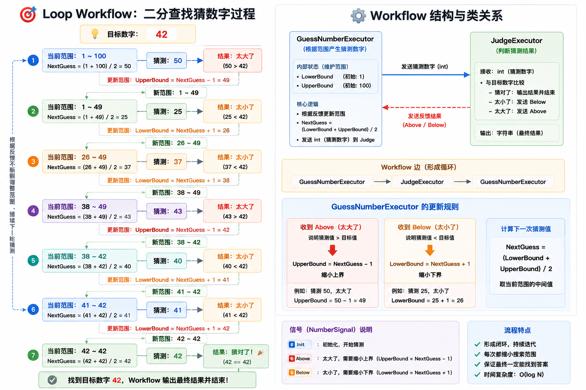
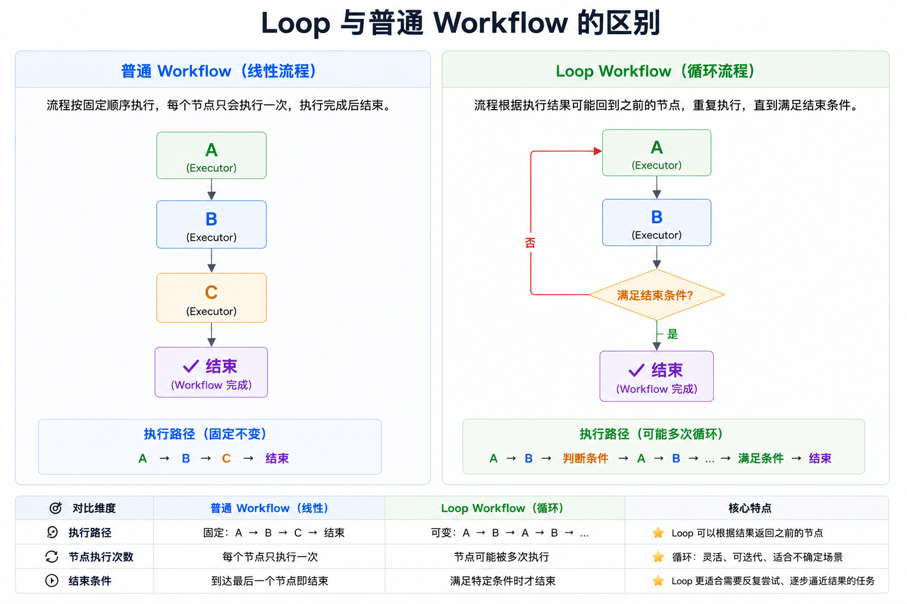

在前面的文章中，我们介绍了顺序执行、条件边、Switch、Fan-Out 等 Workflow 编排方式。
这些示例都有一个共同特点：Workflow 会沿着预先定义好的路径不断向前执行，直到结束。
但在实际业务场景中，有些任务并不是一次执行就能完成的。

例如搜索系统可能需要不断迭代查询结果；规划系统可能需要根据执行结果调整下一步计划；
AI Agent 也可能需要经过多轮推理才能得到最终答案。

对于这类场景，Workflow 需要具备循环执行的能力。

本篇文章通过一个简单的猜数字游戏，介绍 Agent Framework 中如何构建 Loop Workflow。

## 示例场景

在前面的示例中，Workflow 通常沿着预先定义好的路径向前执行。每个节点只会执行一次，流程执行完成后 Workflow 也随之结束。

但有些任务并不能一次完成，而是需要根据执行结果不断调整下一步动作。

例如搜索问题时，需要根据结果重新调整查询条件；规划任务时，需要根据执行结果不断修正计划；而在本示例中，系统需要不断调整猜测范围，直到找到正确答案。

为了演示这种场景，我们使用一个简单的猜数字游戏作为示例。

假设目标数字为：

```text
42
```

系统并不知道正确答案，而是通过二分查找算法不断缩小猜测范围。

当猜测结果过大时，缩小上界；

当猜测结果过小时，提高下界；

然后重新计算下一次猜测值。

整个过程如下图所示：




从图中可以看到，左侧展示的是二分查找不断缩小搜索范围的过程，而右侧展示的是对应的 Workflow 结构。

当 GuessNumberExecutor 产生猜测值后，会交给 JudgeExecutor 进行判断。

如果数字过大，则返回 Above；

如果数字过小，则返回 Below；

然后再次回到 GuessNumberExecutor，根据新的范围计算下一次猜测值。

这个过程会不断重复，直到猜中目标数字。

因此，这类场景已经不适合使用传统的线性 Workflow，而需要 Workflow 具备循环执行能力。

两个 Executor 会不断交替执行：

```csharp
GuessNumberExecutor
        ↓
JudgeExecutor
        ↓
GuessNumberExecutor
```
直到满足结束条件，Workflow 才会结束。

这也是本示例要介绍的核心能力：

Workflow 不再是一条固定向前推进的流水线，而是能够根据执行结果回到之前的节点，从而形成一个循环工作流（Loop Workflow）。


## 核心代码实现

整个 Workflow 的定义非常简单：

```csharp
var workflow = new WorkflowBuilder(guessNumberExecutor)
    .AddEdge(guessNumberExecutor,judgeExecutor)
    .AddEdge(judgeExecutor,guessNumberExecutor)
    .WithOutputFrom(judgeExecutor)
    .Build();
```

虽然代码只有几行，但它完整构建了一个循环工作流。

### 指定入口节点

首先创建入口节点：

```csharp
var workflow = new WorkflowBuilder(
    guessNumberExecutor)
```

这里的 `GuessNumberExecutor` 是整个 Workflow 的起点。

它负责根据当前已知范围计算下一次猜测结果。

Workflow 启动后，首先进入这个节点。

### 建立第一次执行路径

接下来：

```csharp
.AddEdge(
    guessNumberExecutor,
    judgeExecutor)
```

当系统产生一个猜测数字后，交给 `JudgeExecutor` 判断结果。

### 建立反馈回路

然后是整个示例最关键的一行：

```csharp
.AddEdge(
    judgeExecutor,
    guessNumberExecutor)
```

这条边把：

```text
JudgeExecutor
```

重新连接回：

```text
GuessNumberExecutor
```

形成一个闭环：

```text
GuessNumberExecutor
        ↓

JudgeExecutor
        ↓

GuessNumberExecutor
        ↓
JudgeExecutor
```

这也是 Loop Workflow 的核心。

Workflow 不再是一条直线，而是形成了一个反馈回路。

只要没有满足结束条件，流程就会持续运行。

### 指定最终输出

最后：

```csharp
.WithOutputFrom(judgeExecutor)
```

指定 Workflow 的最终输出来自：

```text
JudgeExecutor
```

只有当数字被成功猜中时：

```csharp
await context.YieldOutputAsync(...)
```

才会产生最终结果。

Workflow 也会随之结束。

## GuessNumberExecutor 的作用

`GuessNumberExecutor` 负责产生猜测数字。

为了提高效率，它没有随机猜测，而是采用二分查找算法。

内部维护两个状态：

```csharp
public int LowerBound { get; private set; }

public int UpperBound { get; private set; }
```

表示当前可能的数字范围。

例如：

```text
1 ~ 100
```

第一次猜测：

```text
50
```

如果收到：

```text
Above
```

说明数字更小。

于是：

```text
1 ~ 49
```

再次取中间值：

```text
25
```

如果收到：

```text
Below
```

说明数字更大。

于是：

```text
26 ~ 49
```

如此循环。

核心计算逻辑如下：

```csharp
private int NextGuess =>
    (this.LowerBound + this.UpperBound) / 2;
```

每次都取当前范围的中间值。

因此猜测次数会快速收敛。

## JudgeExecutor 的作用

`JudgeExecutor` 负责判断当前猜测是否正确。

核心逻辑如下：

```csharp
if (message == this._targetNumber)
{
    await context.YieldOutputAsync(...);
}
else if (message < this._targetNumber)
{
    await context.SendMessageAsync(
        NumberSignal.Below);
}
else
{
    await context.SendMessageAsync(
        NumberSignal.Above);
}
```

如果猜中：

```text
Workflow 输出结果
Workflow 结束
```

如果数字偏小：

```text
发送 Below
```

如果数字偏大：

```text
发送 Above
```

然后 Workflow 继续回到：

```text
GuessNumberExecutor
```

进行下一轮猜测。

## Loop Workflow 的终止条件

很多开发者第一次看到循环工作流时都会有一个问题：

```text
Workflow 会不会无限循环？
```

答案取决于是否存在终止条件。

在当前示例中：

```csharp
message == _targetNumber
```

就是终止条件。

一旦满足：

```csharp
await context.YieldOutputAsync(...)
```

Workflow 就会产生最终输出。

后续不再发送新的消息。

循环自然结束。

因此：

```text
GuessNumberExecutor
      ↔
JudgeExecutor
```

虽然形成了环路，但并不会无限执行。

## Loop 与普通 Workflow 的区别

普通 Workflow 更像是一条固定流水线,而 Loop Workflow 则允许 Workflow 根据执行结果重新回到前面的节点：



直到满足终止条件。

这种模式特别适合：

- 搜索与迭代优化
- 自动规划与修正
- 多轮推理
- Agent 自我反思
- Human-in-the-Loop 交互

很多复杂 Agent 系统本质上都建立在 Loop Workflow 之上。

## 小结

本示例介绍了 Agent Framework 中的 Loop Workflow。

通过两条普通的 Edge，Workflow 在 `GuessNumberExecutor` 与 `JudgeExecutor` 之间形成了一个反馈回路，从而实现循环执行。

与顺序执行相比，Loop Workflow 的核心特点在于：Workflow 可以根据执行结果重新回到之前的节点，而不是始终沿着固定路径向前推进。

在实际项目中，Loop 往往是实现多轮推理、自动规划以及复杂 Agent 行为的重要基础能力。
